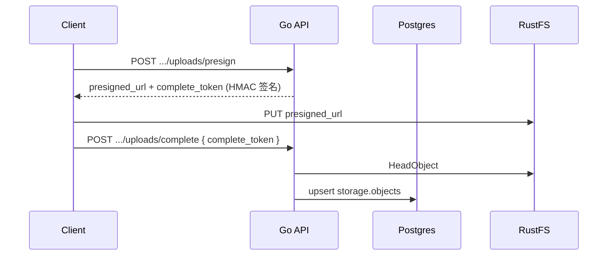

# 架构说明（Supabase Storage 风格 + Go + RustFS）

## 数据分层

与 [Supabase Storage](https://supabase.com/docs/guides/storage/schema/design) 相同：**Postgres 存元数据，S3 只存原文件**。

| 层 | 内容 |
| --- | --- |
| `storage.buckets` / `storage.objects` | 桶与对象元数据 |
| S3（RustFS） | **仅原始上传字节**，不存衍生缩略图 |

`metadata` 约定字段：

```json
{
  "mimetype": "image/jpeg",
  "size": 102400,
  "etag": "\"abc\"",
  "s3_key": "uploads/photos/cat.jpg"
}
```

## 上传流程（Presigned URL）



交付栈（imgproxy + Gotenberg + Poppler）见 [TRANSFORM_BACKENDS.md](./TRANSFORM_BACKENDS.md)。

## 图片交付（Cloudinary 风格，按需变换）

**不预生成、不写入 S3 缩略图路径。** 客户端用 URL 查询参数描述变换，服务端从原图实时渲染：

```
GET /storage/v1/objects/{object_id}/image?w=200&h=200&c=fill&q=80&f=jpg&t=1
```

| 参数 | 含义 |
| --- | --- |
| `w` | 目标宽度（px） |
| `h` | 目标高度（px） |
| `c` | `scale` \| `fit` \| `fill` \| `pad` \| `thumb` |
| `q` | JPEG 质量 1–100 |
| `f` | `auto` \| `jpg` \| `png` \| `webp` |
| `t` | 视频截帧时间（秒），默认 `1` |

| 类型 | 行为 |
| --- | --- |
| `image/*` | 从 S3 读原图 → 变换 → 返回字节流 |
| `video/*` | ffmpeg 按 `t` 截帧 → 再按 `w`/`h`/`c` 变换 |
| 其他 | `415`，请用 `download-url` 或前端 MIME 图标 |

响应带 `Cache-Control`，便于 CDN 按完整 URL 缓存。

### 普通文件

PDF / zip / doc 等不走 `/image`；使用 `GET .../download-url` 或静态图标。

## HTTP API 摘要

- `POST /storage/v1/buckets/{id}/uploads/presign` → `presigned_url`, `complete_token`
- `POST /storage/v1/buckets/{id}/uploads/complete` → body: `{ "complete_token" }`
- `GET /storage/v1/objects/{objectId}/image?w=&h=&c=&q=&f=&t=`
- `GET /storage/v1/objects/{objectId}/download-url`

## 本地启动

```bash
docker compose up -d --build
chmod +x scripts/test-upload.sh
./scripts/test-upload.sh /path/to/image.png
```

Playground：http://localhost:8080/playground/
